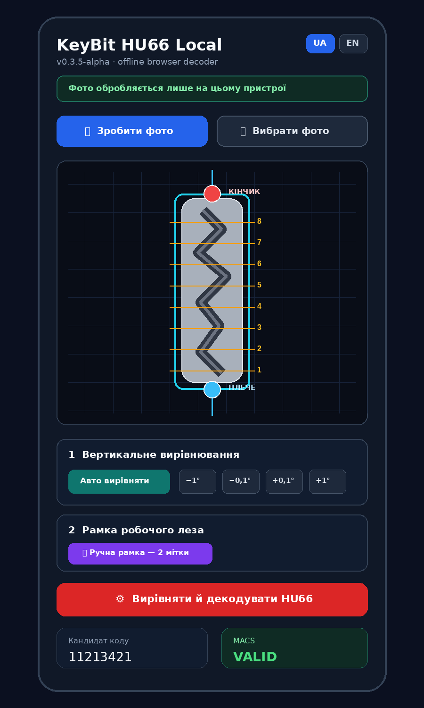

# KeyBit HU66

**Experimental, fully local HU66 internal-track decoder for a phone or desktop browser.**

KeyBit aligns a key-blade photo, normalizes the HU66 working area, extracts the visible track trajectory, estimates the eight bitting positions, and applies an HU66 MACS sanity check. The current public release is an **alpha research preview**, not a production cutting authority.

[Українська версія README](README_UA.md)



> **HU66 position numbering:** positions are counted from the **shoulder toward the tip**. Position 1 is at 3 mm; position 8 is at 24 mm.

## Why this project exists

Commercial key machines are convenient, but the image-processing pipeline behind a usable decoder is an interesting engineering problem in its own right. KeyBit explores a transparent, offline-first approach that can be inspected, tested, and improved in public.

## Current features

- Fully local processing in JavaScript; the app itself does not upload photos.
- Ukrainian and English interface.
- Automatic and manual blade rotation.
- Two-point manual frame: **tip** and **shoulder**.
- HU66 stencil with the current 8.18 × 28 mm profile geometry and position guides numbered from the shoulder toward the tip (1 = 3 mm, 8 = 24 mm).
- Internal-track trajectory extraction with per-position confidence.
- HU66 MACS validation and a separately displayed corrected candidate.
- Debug image and JSON export.
- Single-file offline build; no server or package installation is required for normal use.

## Try it

### GitHub Pages

After GitHub Pages is enabled for the repository root, open the Pages URL on a phone or desktop browser.

### Locally

Download `index.html` or the standalone file from `dist/`, then open it in a browser. For a more predictable browser origin, run a tiny local server:

```bash
python -m http.server 8000
```

Then open `http://localhost:8000`.

## Basic workflow

1. Take or select a sharp photo of an authorized HU66 key.
2. Use **Auto align** and fine rotation controls to make the blade vertical.
3. If automatic geometry is unreliable, enable the manual frame.
4. Place **TIP** at the blade tip and **SHOULDER** at the start of the 28 mm working blade.
5. Decode and inspect the trajectory, position confidence, raw result, and MACS result.
6. Verify the bitting independently before any cutting operation.

## Important limitations

- This is a small-dataset alpha. It is not commercial-grade validation.
- Lighting, reflections, wear, perspective, blade variants, and camera processing can move the detected edge.
- A plausible-looking code can still be wrong.
- MACS is a sanity filter, not proof that a candidate is correct.
- The current public build supports only the HU66 internal-track workflow.
- No manufacturer code database is included.

## Privacy

The application contains no telemetry, analytics, upload endpoint, or remote model call. Image processing happens in the browser. If hosted on GitHub Pages, the hosting platform may still maintain ordinary access logs; KeyBit does not receive or process the selected key photo on a server.

See [docs/PRIVACY.md](docs/PRIVACY.md).

## Authorized use only

Use KeyBit only for keys, locks, and vehicles that you own or are explicitly authorized to service. Do not publish customer key photos, vehicle identifiers, real bitting pairs, EXIF location data, or proprietary commercial databases.

## Verification

The public repository intentionally does not contain customer key photographs or the private regression dataset. The internal alpha has been checked against a small growing set of authorized key/machine pairs, but those checks are not a production guarantee.

The repository includes a build-integrity check:

```bash
npm test
```

It verifies JavaScript syntax, the bilingual UI markers, the presence of alignment/MACS components, the absence of external runtime URLs, and the absence of private regression identifiers in the public build.

See [docs/VALIDATION.md](docs/VALIDATION.md) for the proposed public test protocol.

## Repository layout

```text
.
├── index.html                  # GitHub Pages / direct browser entry point
├── dist/                       # Versioned single-file build
├── docs/                       # Algorithm, privacy, validation, roadmap
├── samples/                    # Policy only; no real customer keys included
├── tools/verify-build.mjs      # Public build integrity check
├── CHANGELOG.md
├── CONTRIBUTING.md
├── SECURITY.md
└── LICENSE
```

## Development philosophy

The browser build is intentionally a sandbox. The priority is to validate geometry and failure handling before wrapping the project in an APK or adding more key families. New profiles should be data-driven only after the common alignment and measurement engine is stable.

## Contributing

Issues and pull requests are welcome. Please read [CONTRIBUTING.md](CONTRIBUTING.md) before submitting photos or test data. Never attach an identifiable customer key or an unauthorized bitting pair to a public issue.

## License

GPL-3.0-or-later. See [LICENSE](LICENSE).

## Disclaimer

KeyBit is experimental software provided without warranty. Always verify measurements and bitting using an independent authorized method before cutting or modifying a key.
